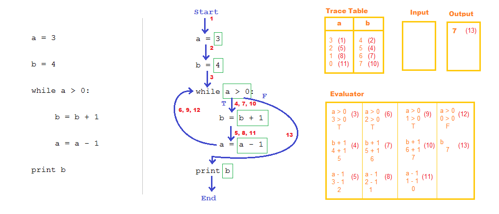
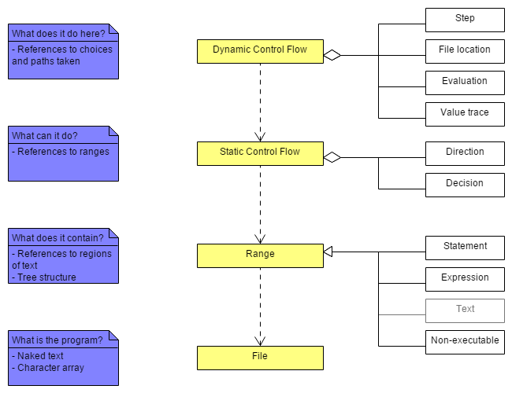

# TRACS
University of Glasgow Final Year Computing Science Individual Project

Project Supervisor: Quintin Cutts

---

Amongst the many aims of teaching programming, one is to help students develop a mental model of how a computer works: a “notional machine”. Inappropriate mental models can be attributed to a significant portion of errors committed while programming. Another contributing factor is that teachers may proceed too quickly and introduce more complex concepts before the student fully understands the basic ones.

**Can you test if the model is correctly understood?**

A simple means of annotating code has been developed by Professor Quintin Cutts et al. that is already used in a number of schools in Scotland. It is language independent, and it enables the viewer to see all inner workings at once. Given a program written/printed out as plain text, students work through an exercise by completing the following steps:

1. Draw a box around any *expressions*. (These include boolean expressions such as `a > 0` and others, such as strings (`"Hello, world!"`) or numbers (`100`, `9.37`), etc.)
2. Draw arrows to denote *static control flow*.
3. Number the arrows (perhaps more than once) to indicate *dynamic control flow* steps.
4. Fill in a number of "areas" that provide more detail of the dynamic execution:
    * A variable trace table;
    * An expression evaluation area;
	* Text Input/Output areas.  

    Entries in all of these areas are labelled with a number indicating which step in the execution they happened on.

Although the annotation system is easy to do with pen and paper, it can be messy and are hard to reproduce as a set exercise. Electronic solutions are cleaner, but take significantly more effort to create. For example, the example image below took over 30 minutes to create.

Enter this project.

I have been tasked with developing a web-based system to facilitate these code annotations. The basic structure can be understood as follows:

We first import a program file and then select a series of ranges of text. We then identify the possible paths given by the static control flow, before moving on to the actual path taken in the dynamic control flow.
